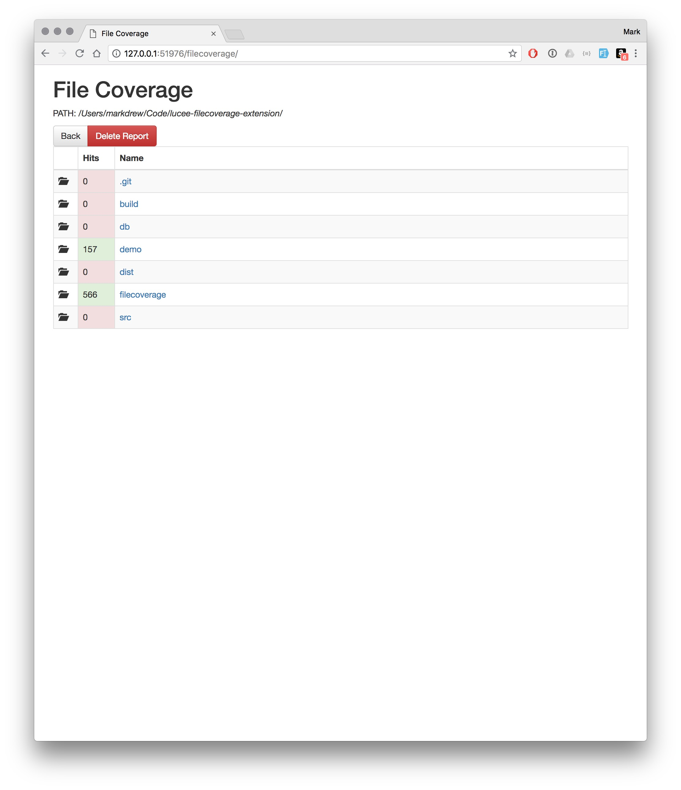
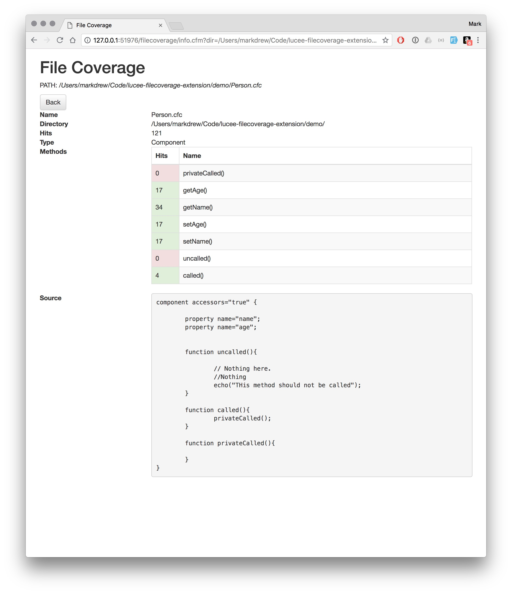

# Lucee File Coverage Extension
[](https://travis-ci.com/cybersonic/lucee-filecoverage-extension)
This extension provides a debugging template that logs all the calls to script files as a user navigates your site. It then allows you to browse which files have been used and more importantly which have not

## Getting Started

(We are hoping this will go onto the lucee extension store in the future).


Check out the installation guide. At the moment this is the main way of installing it until we get this everything ready to be added to the Lucee Extension "store". 

I would love to be able to actually add this to http://forgebox.io too. 


### Prerequisites

- Apache Ant to build the project (it is running a simple build.xml file)
- Lucee 5.x and greater. No ACF implementation yet. 
- Currently it is also using the H2 database extension. Which can be installed fropm the Extension:Applications section of the admin.


### Installing

First you need to build the project, simply go into the root and run:
```
ant
```

This will create a file in the `dist` folder called `filecoverage-extension-X.X.X.X.lex`. This extension is meant to deployed to a *web context* (versus a server context) as it installs the reporting application into your webroot in a folder called `/filecoverage` so you can access it as http://localhost/filecoverage.

1. Go to the Lucee web administrator - http://localhost/lucee/admin/web.cfm  and log in
1. Click on `Applications` under *Extension*
1. Scroll to the bottom to where it says "Upload new extension (experimental)" and choose the `filecoverage-extension-X.X.X.X.lex` we created and click *Upload*
1. Since we need to use a database to store the captured data, instal the `H2` database
1. Create a datasource called `codecoverage` using the H2 Database Engine in Embedded Mode
1. Put a path in the path section (for example "db") and click save
1. Under *Debugging:Settings* click "Yes" to enable debugging. 
1. Under *Debugging:Templates* enter a label such as "CodeCoverage" and select the "File Coverage" template type and click create
1. In the Datasource Name field enter 'codecoverage' and click submit ( you can also then limit to which IP ranges you want this debugging template to work with)

The site is now ready for testing. You just need to browse it. The next part is viewing the results.


### Reports
	
At the moment this is pretty rough and ready and you just need to go to http://localhost/filecoverage to view how many hits each file gets as well as some information on which functions/methods are used in a CFC. 






<!-- End with an example of getting some data out of the system or using it for a little demo

## Running the tests

Explain how to run the automated tests for this system

### Break down into end to end tests

Explain what these tests test and why

```
Give an example
```

### And coding style tests

Explain what these tests test and why

```
Give an example
```
 -->
## Deployment

This extension should *NOT* be deployed on a live system. It's meant to be used as part of an investigation or your testing process. DO. NOT. RUN. ON. A. LIVE. SYSTEM.
You have been warned.


<!-- ## Contributing

Please read [CONTRIBUTING.md](https://gist.github.com/PurpleBooth/b24679402957c63ec426) for details on our code of conduct, and the process for submitting pull requests to us.
 -->
## Versioning


We use [SemVer](http://semver.org/) for versioning. <!-- For the versions available, see the [tags on this repository](https://github.com/your/project/tags).  -->

## Authors

* **Mark Drew** - *Initial work* - [cybersonic](https://github.com/cybersonic)

<!-- See also the list of [contributors](https://github.com/your/project/contributors) who participated in this project. -->

## License

This project is licensed under the MIT License - see the [LICENSE](LICENSE) file for details
<!-- 
## Acknowledgments

* Hat tip to anyone whose code was used
* Inspiration
* etc
 -->